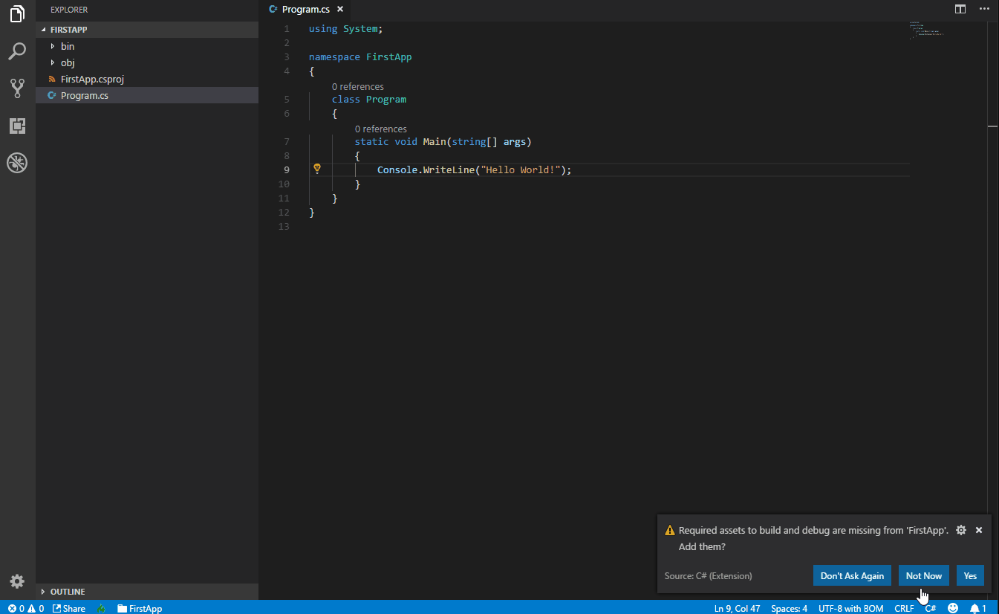
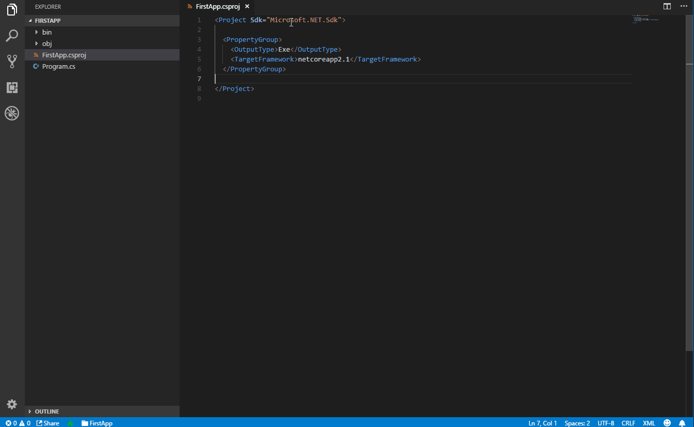
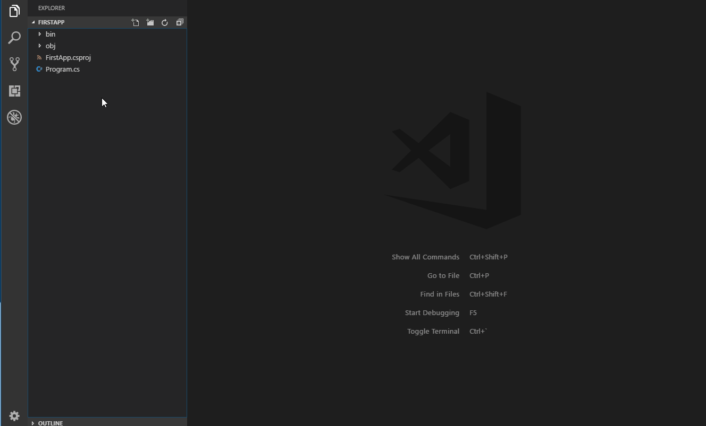
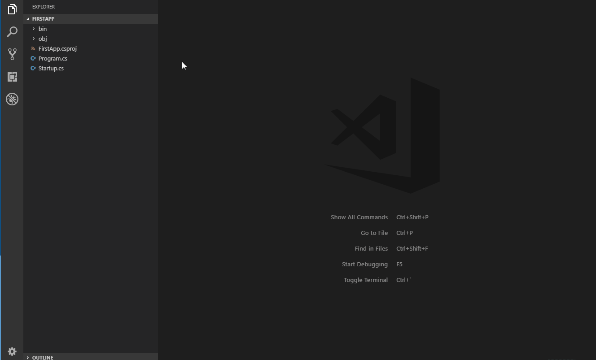

# Module 1: Getting Started with ASP.NET Core 

*Module goals: Introduce your audience to .NET Core and the available tools and resources.*
*Spend time on the .NET CLI show new,run,and watch*
<br><br>


## Install the .NET Core SDK 
 *Go to https://dot.net and follow the instructions to download and install the .NET Core SDK for your OS*

### Setting up on different environments
[**OS X**](https://www.microsoft.com/net/core#macos)

- Install Pre-requisites : [Homebrew](http://brew.sh/) and [OpenSSL](https://www.openssl.org/)
- .NET Core  for OS X

[**Windows**](https://www.microsoft.com/net/core#windows)

- Install .NET Core

[**Linux**](https://www.microsoft.com/net/core#ubuntu)

- Set up the apt-get that hosts the packages 
- Install .NET Core SDK
<br><br>


## Introduction to the .NET CLI

### Test if .NET is installed
- Go to Command Prompt for Windows or Terminal for Linux/MacOS and type 
```sh
    dotnet 
```


### Create Console App with .Net CLI
- Create and run your first console app
```sh
    mkdir FirstApp

    cd FirstApp

    dotnet new console
```


*The first parameter 'new' tell dotnet to initialize new .NET project. The second parameter tell dotnet which template should be used in this project. For our case, 'console' indicates Console Application. For more informartion, you can use the command below to checkout more*
```sh
    dotnet help
    dotnet new -h
```
### Restore dependencies specified in the .NET project.
```sh
    dotnet restore
```

### Run the console application
```sh
    dotnet run
```

<br><br>


## Open Project with Visual Studio Code from Command Line
*For this section it's a good idea to have [Vs Code](https://code.visualstudio.com/) installed or you can open it in notepad.  You can download it [here](https://code.visualstudio.com/).*

- Take a look at the project created with .NET CLI in Vs Code with command line

```sh
    code .
```

### Edit Code in Program.cs

```sh
    static void Main(string[] args)
        {
            string name;
            
            Console.WriteLine("What's your name?");
            name = Console.ReadLine();

            Console.WriteLine($"Hello {name} thanks for using this material");
            
        }
```

### Test the Code
- Now, try to run the console application again with command line
<br><br>


## Adding Package to Project
*Option 1: Edit csproj file manually*

### What is .csproj file?
- ".csproj" is a Visual Studio .NET C# Project file extension. This file will have information about the files included in that project, assemblies used in that project
*Edit by hand*
```sh
<Project Sdk="Microsoft.NET.Sdk">

  <PropertyGroup>
    <OutputType>Exe</OutputType>
    <TargetFramework>netcoreapp2.0</TargetFramework>

    <ItemGroup>
        <PackageReference Include="Microsoft.AspNetCore" Version="2.1.2" />
    </ItemGroup>
</Project>
   ```
   
   - Restore the packages 
```sh
    dotnet restore
```

<br>

*Option 2: Add package using the .Net CLI*
``
- In your terminal/command prompt,make sure you are in the project directory. Use the command line below to add package into the project with .Net CLI
```sh
   dotnet add package Microsoft.AspNetCore
```


*You don't need to run `dotnet restore` because when using command line, it auto restored pacakage*
<br><br>

## Change the Console App into Web App
- Add a Startup.cs file that defines the request handling logic:
```sh
using System;
using Microsoft.AspNetCore.Builder;
using Microsoft.AspNetCore.Hosting;
using Microsoft.AspNetCore.Http;

namespace FirstApp
{
    public class Startup
    {
        public void Configure(IApplicationBuilder app)
        {
            app.Run(context =>
            {
                return context.Response.WriteAsync("Hello Web!");
            });
        }
    }
}
```

- Update Program.cs to setup and start the web host 
```sh
using System;
using Microsoft.AspNetCore.Hosting;

namespace FirstApp
{
    public class Program
    {
        public static void Main(string[] args)
        {
            var host = new WebHostBuilder()
                .UseKestrel()
                .UseStartup<Startup>()
                .Build();

            host.Run();
        }
    }
}
```

- Run the app 
```sh
    dotnet run
```

- Go to  http://localhost:5000 in your browser
<br><br>

### Extra 
Consider showing [dotnet watch](https://docs.microsoft.com/en-us/aspnet/core/tutorials/dotnet-watch).
- Open csproj file and add the Microsoft.DotNet.Watcher.Tools into the `<ItemGroup>`

```
    <DotNetCliToolReference Include="Microsoft.DotNet.Watcher.Tools" Version="*" />
```
 
- Restore packages
```sh
    dotnet restore
```
- Use the command line below to run your app 
```sh
    dotnet watch run
```
- Now, try change the `Hello Web!` string in `Startup.cs` into the word below or any word you want and save.
```sh
    return context.Response.WriteAsync("Web App rocks the world!!");
```
*Refresh the page without using any commands and see the changes*
<br><br>
## Resources
- [dot.net](https://www.microsoft.com/net) 

- [docs.microsoft.com](https://docs.microsoft.com/)
