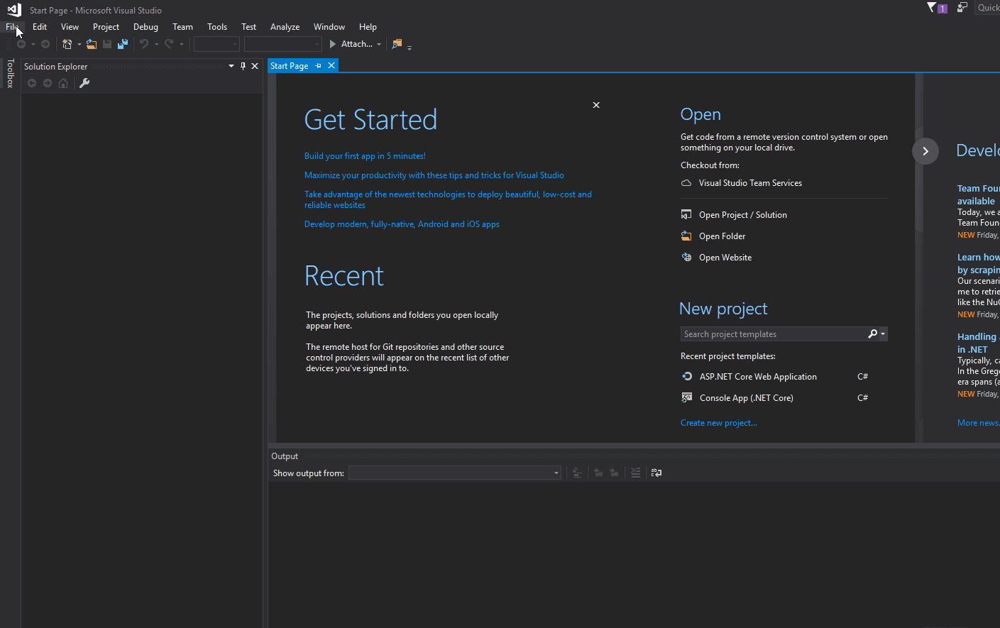
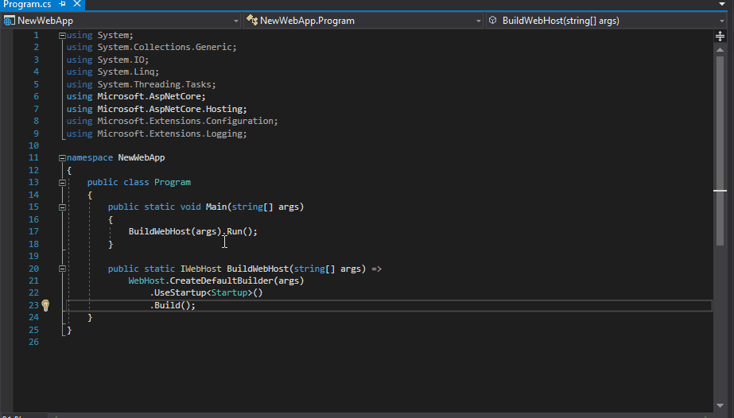
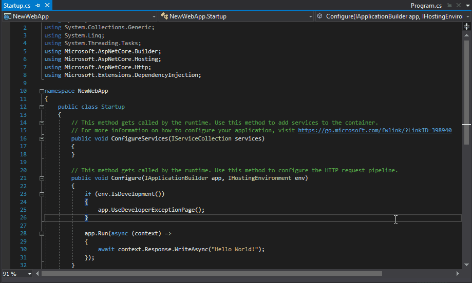
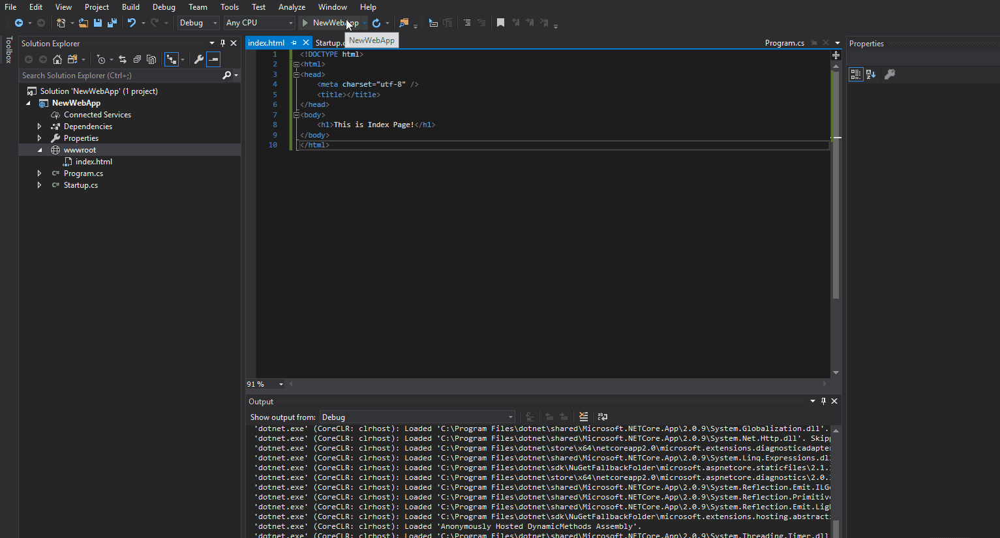

# Module 2: Introduction into ASP.NET Core 


*Module goal: In this module we are taking the audience from Console App to Web App. During the module will be introduced to the following:*
- *Create a new web app both in Visual Studio and commandline*
- *How to run an application with IIS or Kestrel*
- *An intro to using the middleware. E.g. Serving Static files*
<br><br>

## Create a new Web Application 

*Option 1: Open new project with Visual Studio 2017*

- Open up Visual Studio
- Create a new ASP.NET Core application 

    Go to File New Project ->.NETCore -> ASP.NET Core Web Application (.NET Core) and choose Empty project.
    
    
    

*Option 2: Open new project with .Net CLI*
- Again, create a directory named "MyWebApp" and in the folder use the command below to create a Web App with command line.
  
    ```
    mkdir MyWebApp
    cd MyWebApp
    dotnet new web
    code .
    ```
> **Note:** This module require you to create project with Visual Studio, *Option 2* is just an additional information

<br><br>
     
## Running the application under IIS or on Kestrel 
- Change the Debug drop down in the toolbar to the application name
    
 

- Run the application and navigate to the root. It should show the hello world middleware.
- Change the port to `8081` by adding a call to `UseUrls` in the `Program.cs`:

   ```
    public class Program
    {
        public static void Main(string[] args)
        {
            var host = new WebHostBuilder()
                .UseKestrel()
                .UseUrls("http://localhost:8081")
                .UseContentRoot(Directory.GetCurrentDirectory())
                .UseIISIntegration()
                .UseStartup<Startup>()
                .Build();
            host.Run();
        }
    }
   ```

    
   
- Navigate to the project properties (by right clicking on the project, and selection `Properties`)
- Go to the `Debug` tab --> Application properties--> Debug and change `Launch Browser` to `http://localhost:8081`
   
   

- Run the application and navigate to the root. It should show the hello world middleware running on port 8081.

> **Note:** If the page does not load correctly, verify that the console application host is running and refresh the browser.

<br><br>
## Using the Middleware

### Serving static Pages
- Add the `Microsoft.AspNetCore.StaticFiles` package to project: 

*Use NuGet package manager*

- Open NuGet Package Manager from Tools->NuGet Package Manager->Manage


- Go to `Startup.cs` in the `Configure` method and add `UseStaticFiles` before the hello world middleware:

```
  public void Configure(IApplicationBuilder app, IHostingEnvironment env)
  {
      loggerFactory.AddConsole();

      if (env.IsDevelopment())
      {
          app.UseDeveloperExceptionPage();
      }

      app.UseStaticFiles();

      app.Run(async (context) =>
      {
          await context.Response.WriteAsync("Hello World!");
      });
  }
```



### Create a Static Page
- Create a file called `index.html` with the following contents in the `wwwroot` folder:

```
<!DOCTYPE html>
<html>
<head>
    <meta charset="utf-8" />
    <title></title>
</head>
<body>
    <h1>This is Index Page!</h1>
</body>
</html>
  ```

- Run the application and navigate to the root. It should show the hello world middleware.
- Navigate to `index.html` and it should show the static page in `wwwroot`.


<br><br>

## Adding default document support

- Change the static files middleware in `Startup.cs` from `app.UseStaticFiles()` to `app.UseFileServer()`.

- Run the application. The default page `index.html` should show when navigating to the root of the site.

- You can also enable directory browsing by change`app.UseFileServer()` to 
`app.UseFileServer(enableDirectoryBrowsing: true)`


<br><br>

## Changing environments

- The Environment Variables located at the Debug section of the Application Properties


  
- Add some code to the `Configure` method in `Startup.cs` to print out the environment name. Make sure you comment out the UseFileServer middleware. Otherwise you'll still get the same default static page.

  ```C#
      app.Run(async (context) =>
      {
          await context.Response.WriteAsync($"Hello World! {env.EnvironmentName}");
      });
  ```

- Run the application and it should print out `Hello World! Development`. 
- Change the application to run in the `Production` environment by changing the `ASPNETCORE_ENVIRONMENT` environment variable on the `Debug` property page:


- Run the application and it should print out `Hello World! Production`.

